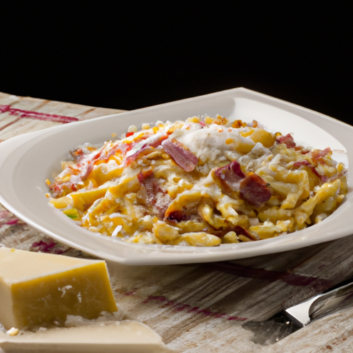
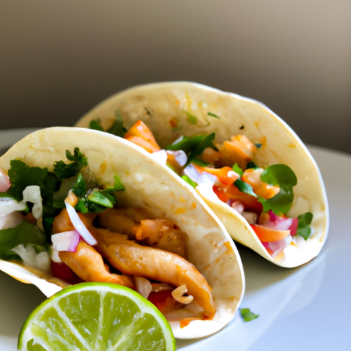
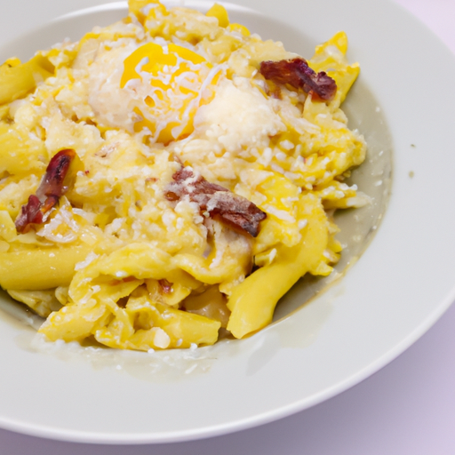
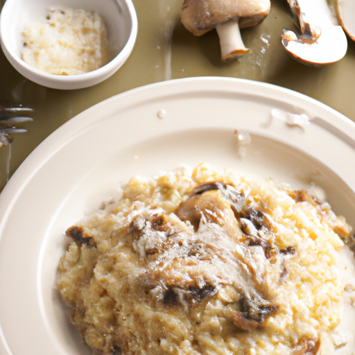
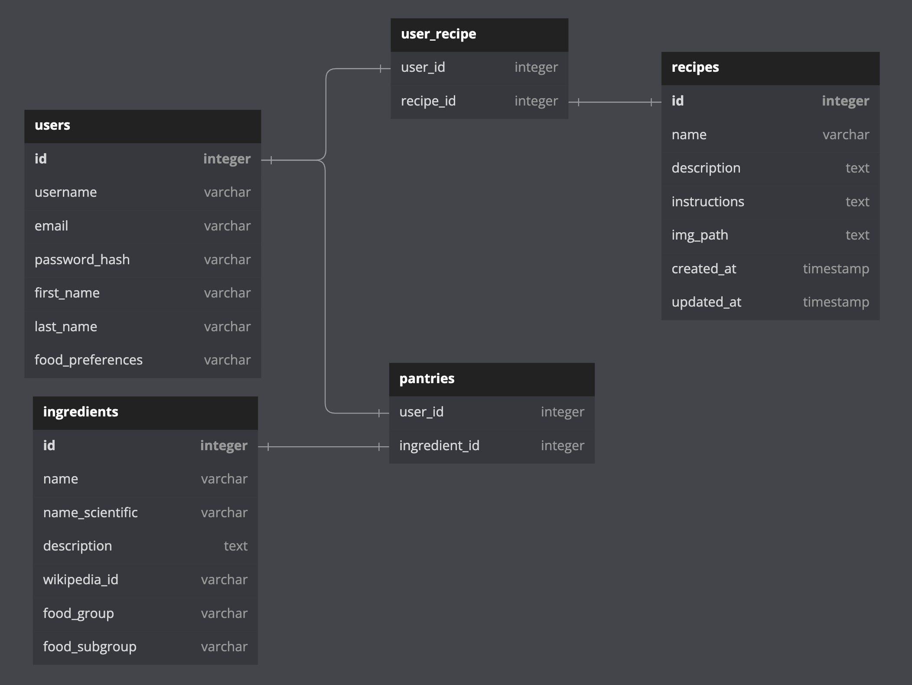

# flavora

A django / react web app that allows users generate custom food recipes based on
the their food preferences, ingredients, and cooking time.

<!--  {with=200} -->
 

## Goals

- Build a web app that allows users to generate declicious and maybe
  questionable new food recipes using OpenAI API.
- Allow users to choose from a list of ingredients (900+) and save them to their
  "pantry". All items in a user's pantry will be passed into the ChatGPT API
  query, with the option to add additional items.
- Allow users to save food preferences (i.e. vegitarian, pescatarian, vegan,
  etc.) which will then be passed into the ChatGPT API query.
- Allow user's to save all of their generated recipes into their own "Cookbook".
- _Stretch_ Allow users to generate an image of what their recipe could look
  like by passing the recipe description into the Dall-E API. The image will
  then be saved into the their cookbook.

## APIs

- OpenAI API (Generate recipes and _maybe_ images of said recipe)
- fooddb API (All ingredient info will come from this API)

## Challenges / Considerations

- Priming the language model (gpt-3.5-turbo or text-davinci-003) to get
  compelling outputs and reduce token count.
  - Fine tune the model.
- Storing ingredients in either postgres or JSON file.

## Database Schema

