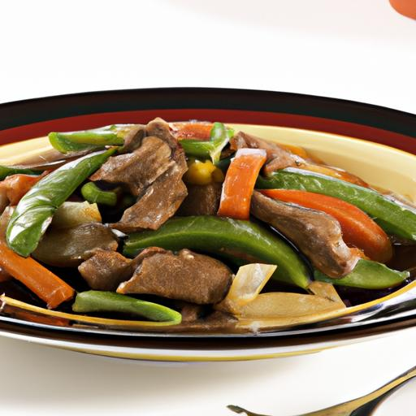
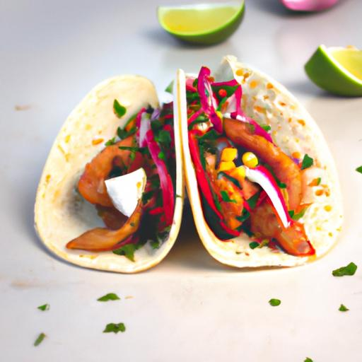
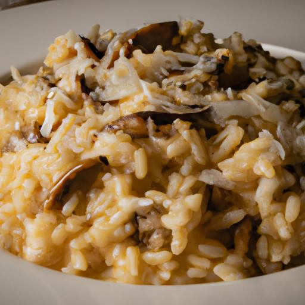

# Flavora

Flavora is a web application developed using React, Django, and React Bootstrap. It is designed to allow users to manage their pantry, create recipes using the OpenAI API, and organize them in a cookbook.

## Features

- User Authentication: Users can create accounts, log in, and log out to access
  personalized features and data.
- Pantry: Users can add, remove, and view ingredients in their pantry.
- Recipe Creation: Open AI API chat completion endpoint is used to allow users
  to create new recipes by specifying ingredients, dietary restrictions, and
  maximum cooking time. The Image Generation endpoint is used to create an image
  of the recipe based on the recipe's description.
- Cookbook: Recipes can be saved to a cookbook.

## Technologies

- Django
- Django REST Framework
- React
- React Bootstrap
- React Router
- Axios
- PostgreSQL

## Installation and Setup

1. Clone the repository: git clone https://github.com/cjmakin/flavora
2. Install dependencies:
   - Frontend: Navigate to the flavora/src/client directory and run npm install.
   - Backend: Set up a virtual environment and install Python dependencies from
     the requirements.txt file.
3. Configure the database connection in the Django settings file.
4. Run migrations: python manage.py migrate.
5. Start the development server:
   - Frontend: Run npm start in the flavora/src/client directory.
   - Backend: Run python flavora/src/manage.py runserver.

## Database Schema

